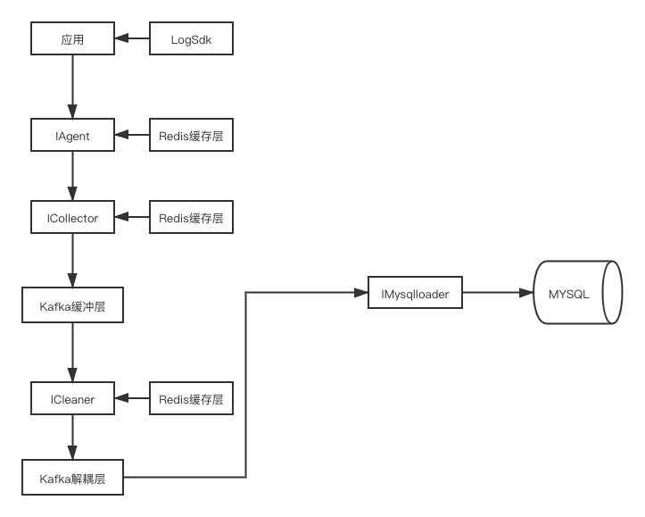
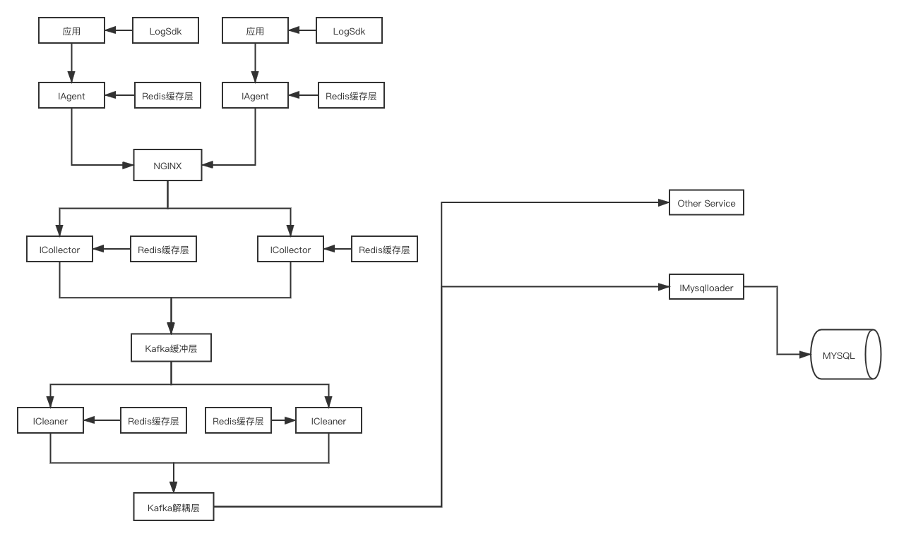
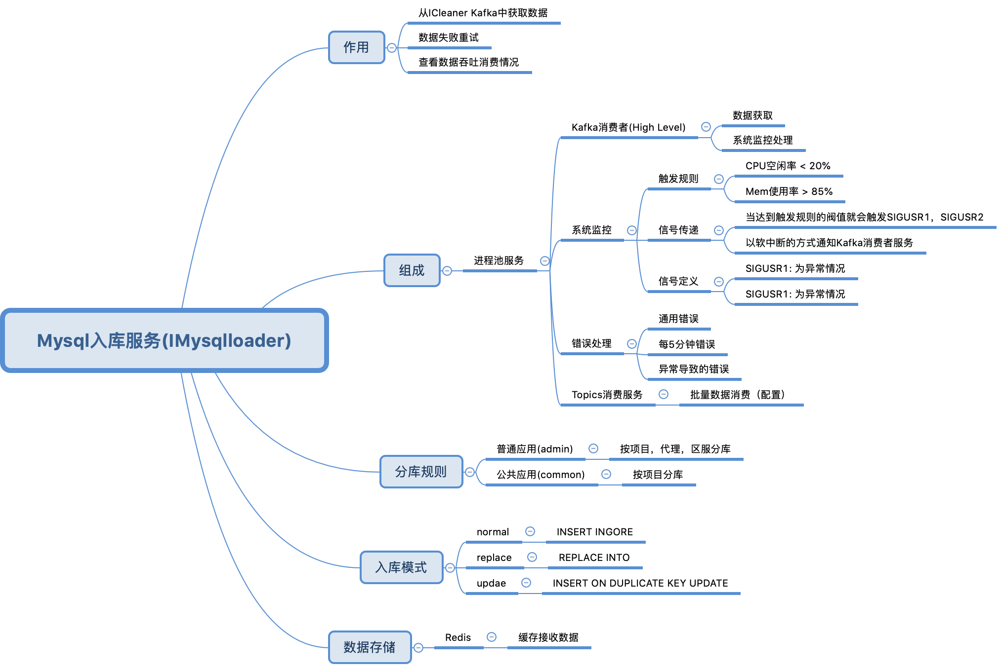

#### 日志服务架构图
- 基础架构
  - 
- 可拓展架构
  - 

#### Mysql入库服务(IMysqlloader)


#### 依赖环境
- PHP 7.x
- Swoole 4.x
- Swoft 2.x

#### 启动方式
- 进程池 Server
  - php bin/swoft process:start
- Topics 消费情况查看
  - php bin/swoft topics

#### 配置说明
- 项目代理配置
  - config/agent_config_19.php // 19为项目代号
    ```
    [
        1 => 'tx',
        2 => 'local',
        3 => 'debugand',
        4 => 'debugios'
    ]
    ```
- 数据库分库配置
  - config/database_rule.php
    ``` 
    [
        'backgrouds' => [
            'admin' => [    //按 app_name, agent_name,sever_id分库
                    'template' => '%s_%s_%s', // 库名模板
                    'separator' => '_',
                    'parameter' => 3,
                    'parameterCheck' => ['is_string', 'is_string', 'is_numeric']    // 参数检测
                ], 
            'common' => [
                    'template' => '%s_%s',
                    'parameter' => 2,
                    'separator' => '_',
                    'parameterCheck' => ['is_string', 'is_string'],
                    'last_default' => 'common'
                ]
        ],
        'handlerFunc' => [
            'admin' => [
                'func' => 'adminHandlerFunc',   // 回调处理方法
                'need_parameter' => [
                    'agent_id', 'server_id' // 需要检测的两个参数
                ]
            ],
            'common' => [
                'func' => 'commonHandlerFunc'
            ]
        ]
    ]
    ```
- 项目日志配置
  - config/app_log_19.php // 19为项目代号
  ```
    [
        'log_god_body_op' => [  // topics名称
            'backgrouds' => [   // 配置的应用方式，可多配置
                'admin',
                'common'
            ],
            'save_mode' => 'replace',   // MySQL数据库入库方式
            'table' => 't_log_god_body_op'  // 表名
        ],
        'log_barter' => [
            'backgrouds' => [
                'admin',
                'common'
            ],
            'save_mode' => 'replace',
            'table' => 't_log_barter'
        ]
    ]
  ```

#### 不足之处
- 错误机制未完善
- 后续需要通过 Supervisord 对服务进行统一管理
- 系统监控还没有
- 数据库配置应该抽象到独立的配置中心